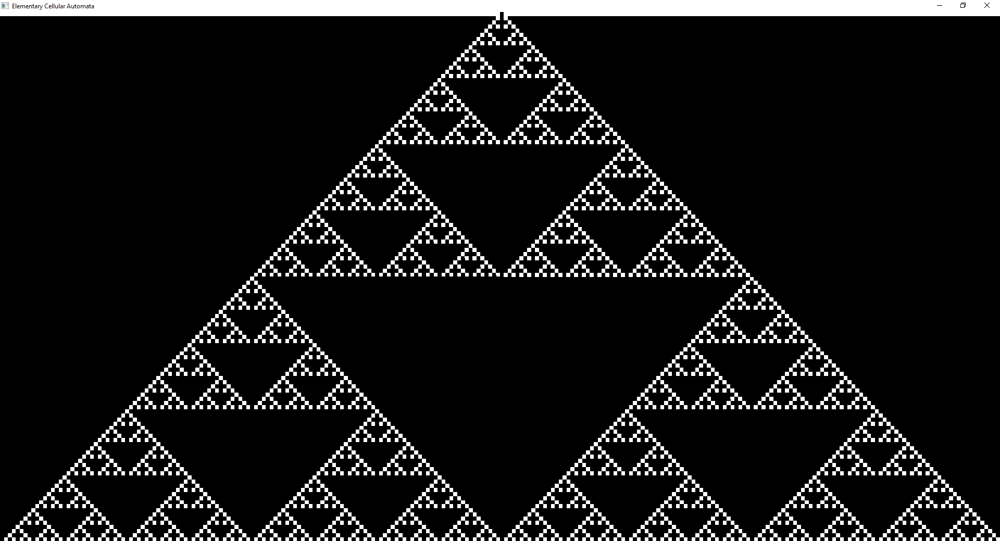

# ECA-SDL-C
A practice project to learn C and SDL by making a Elementary Cellular Automata




<br>

>**Note:** This program was primarly made to run on Windows 10 so there is no guarantee that it will run on other operating systems.

## Requirements

* gcc (For compiling)
* SDL2 (For graphics)
> Note: For SDL2 the Makefile assumes that SDL2's include and lib files are in a folder called src in the root directory of the project
* Make (For building)

## How to install
> There are various was to install the required libraries for different operating systems but I am gonna outline how to install them on Windows 10

* gcc (For compiling)
    * Follow the guide by VSCode to configure gcc on Windows https://code.visualstudio.com/docs/cpp/config-mingw
* SDL2 (for graphics)
    * Go to https://github.com/libsdl-org/SDL/releases/latest and download the development libraries for Windows (It would be named something like SDL2-devel-2.30.4-mingw.tar.gz)
    * Go to your Download folder or wherever you downloaded the file and run `tar -xvzf SDL2-devel-2.30.4-mingw.tar.gz -C SDL2` to extract the files
    * Go to the SDL2 folder and go to x86_64-w64-mingw32 and copy the **include** and **lib** folders to a folder called src in the root directory of the project
    * Also go to the SDL2 folder and go to x86_64-w64-mingw32/bin and copy the **SDL2.dll** file to the root directory of the project
* Make (For building)
    * After following the guide by VSCode to configure gcc on Windows you should open the terminal of MSYS2 and run `pacman -S make` to install make
    * Now make is installed but we need to add it to the path so we can access it outside of the MSYS2 terminal
    * Find the make.exe file usually located in ({Disk}:MSYS2\usr\bin)
    * Add it to the path by going to the environment variables and adding the path to the make.exe file


## How to run

1. Clone the repository 
```
git clone https://github.com/Arisamiga/ECA-SDL-C.git .
```

2. Run `make` in the root directory to build the c file
```
make
```

3. Run `./main.exe` to run the program
```
./main.exe
```

## How to use

* The program will run and display the "109" rule. If you want to change the rule you can add it as the first argument when executing the main.exe file
```
./main.exe 109
```
* The program will display the rule 109


## Code and bug reporting
You can open a issue at https://github.com/Arisamiga/ECA-SDL-C/issues
